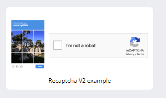
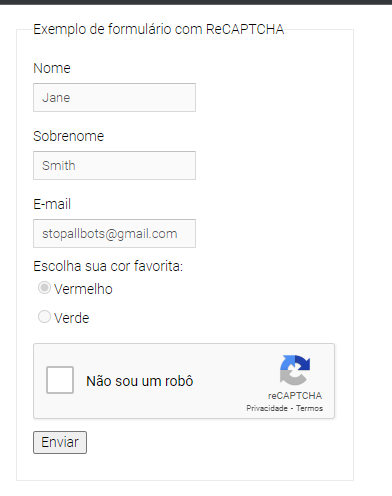

Implementação de um solucionador de captcha, no caso ReCaptchaV2Proxyless:

https://www.google.com/recaptcha/api2/demo

Obs: é preciso possuir creditos no serviço [https://anti-captcha.com](http://getcaptchasolution.com/bfq8qrpmgf)